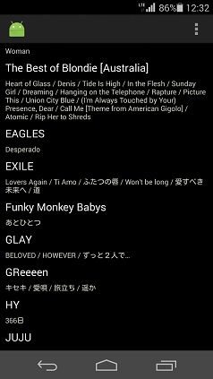
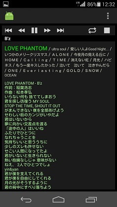

## mp3player
ホルダー単位で再生するプレーヤー  
.lycファイル歌詞の表示も出来ます。（埋め込み歌詞は対応準備中）  
  
ホルダー名またはホルダー内リストをタップすると先頭の曲から演奏を始めます。  
  
拡大されているのが演奏中の曲です。  
通常モードは全てのホルダーの通し演奏です。  
リピートボタンをタップすると、１曲リピート→ホルダー内リピート→通常モード
の順に切り替わります。  
